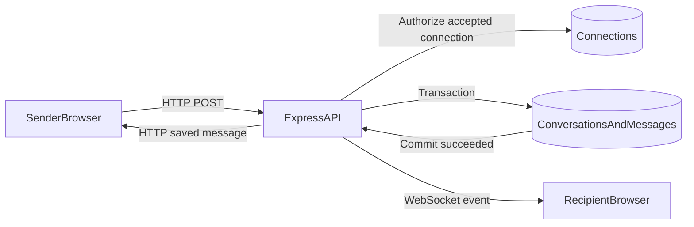
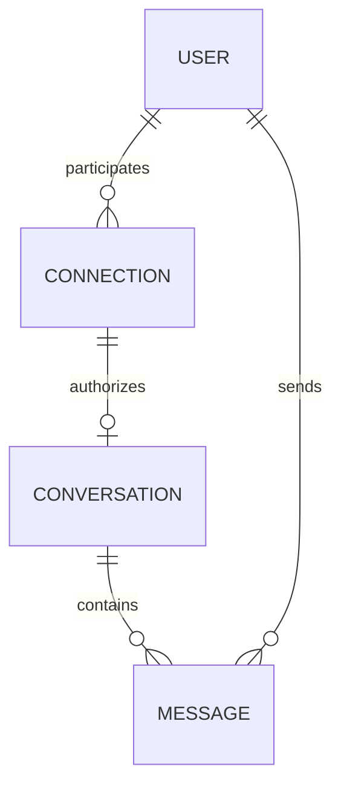
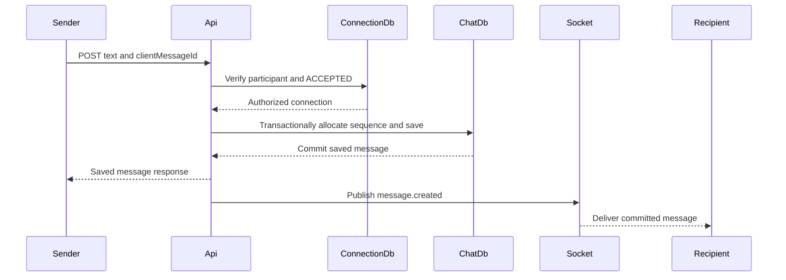

# Tinder Lite Chat Backend Design Notes

## Document status

This document describes the proposed backend design for one-to-one text chat between users whose connection is accepted.

It is a design document, not a statement that the feature is already implemented. Decisions that have not yet been made are marked as open decisions.

The initial design deliberately supports a small product scope while preserving clean boundaries for future production growth.

Current implementation status on 2026-09-05:

- The strictly typed server-to-client `message.created` event name and wire payload are defined and
  composed into the shared Socket.IO server event map.
- The generic WebSocket module exports one process-local `io` instance, and server startup attaches
  that instance to the Node HTTP server. The chat publisher imports the same instance directly. A
  newly created Message publishes only after the transaction resolves; retries and failed writes do
  not publish, and realtime failure does not fail the durable HTTP send.
- The typed client-to-server `message.mark-delivered` command acknowledges one Conversation through
  a sequence number. The chat service now authorizes the participant and accepted Connection,
  rejects positions beyond the Conversation, and atomically advances only a newer delivered
  watermark. The authenticated Socket.IO listener calls that service and emits the server-to-client
  `message.delivered` event to the other participant's devices only when the watermark advances.
- The typed `message.mark-read` command advances read and delivered watermarks inside a transaction
  and recomputes unread incoming messages from the same snapshot. After a real watermark change, the
  server emits `message.read` to the other participant's devices for live blue-tick updates.

---

## 1. The design in one minute

An accepted `Connection` is the authorization root for a chat.

Each accepted connection can have at most one `Conversation`. Each conversation can have many `Message` documents.

The browser sends a new message through HTTP. The backend:

1. Authenticates the sender from the existing JWT cookie.
2. Confirms that the sender belongs to the connection.
3. Confirms that the connection status is `ACCEPTED`.
4. Creates the conversation on the first successful message if it does not exist.
5. Stores the message and updates the conversation summary in one MongoDB transaction.
6. Returns the saved message to the sender.
7. Pushes the committed message to the recipient over WebSocket.

The browser uses one WebSocket per active app instance, not one socket per conversation. Every event carries a `conversationId`, allowing one socket to carry events for all of the user's conversations.

Message ordering uses a server-assigned sequence number. Delivery and read state use sequence watermarks, avoiding an update to every historical message.



---

## 2. Initial product scope

### Included

- One-to-one chat only.
- Plain-text messages only.
- Chat only between accepted connections.
- One conversation per accepted connection.
- Conversation inbox ordered by recent activity.
- Latest-message preview.
- Message history in pages of 30.
- Stable cursor pagination.
- Real-time incoming messages through WebSocket.
- Offline durability through MongoDB.
- Optimistic-send support through `clientMessageId`.
- Safe retries without duplicate messages.
- Server-authoritative message time and ordering.
- Sent, delivered and read states.
- Per-conversation unread count.
- Up to a configurable number of active sockets per user; the proposed initial value is five.
- Heartbeats, stale-socket cleanup and JWT-expiry enforcement.
- Input validation, authorization and basic rate limiting.

### Excluded from the first version

- Images, videos, files and voice notes.
- Typing indicators.
- Online presence and last seen.
- Push or email notifications.
- Reactions and replies.
- Message editing.
- Delete for self or delete for everyone.
- Search.
- Group chat.
- Voice or video calls.
- Disappearing messages.
- End-to-end encryption.
- Automated content moderation.

These exclusions are product-scope decisions, not claims that the architecture can never support them.

---

## 3. Existing backend context

The current backend uses:

- Node.js with TypeScript.
- Express 5.
- Mongoose and MongoDB.
- An HttpOnly JWT cookie.
- A two-hour access-token lifetime.
- PM2 deployment on a long-running server.
- Request IDs and request access logs.

Relevant current files:

- `src/app.ts` constructs and exports Express without opening a network listener.
- `src/server.ts` loads local environment values, connects MongoDB, creates the Node HTTP server, attaches Socket.IO and starts listening.
- `src/web-socket/web-socket.ts` owns and exports the one typed Socket.IO server, authenticates
  handshakes, joins private user rooms and owns JWT-expiry cleanup in lifecycle order.
- `src/api.routes.ts` mounts protected version-one routes after `authMiddleware`.
- `src/middlewares/auth-middleware.ts` verifies the cookie JWT and loads the user.
- `src/lib/jwt.ts` generates and verifies access tokens.
- `src/lib/jwt.constants.ts` defines the two-hour token lifetime.
- `src/lib/request-context.ts` provides request-local correlation IDs.
- `src/modules/connection/connection.model.ts` stores connection participants and status.
- `src/modules/connection/connection.service.ts` implements connection creation and transitions.

### Existing relationship model

The current `Connection` model already has the most important chat rule:

- `senderId`
- `receiverId`
- canonical `minUserId` and `maxUserId`
- a status including `ACCEPTED`
- a unique index on the unordered user pair

This means the connection record should remain the source of truth for whether two users may chat.

### Existing gaps that matter to chat

- Socket.IO handshakes now have exact Origin validation and existing-cookie JWT authentication, but there are no socket caps or business event handlers yet.
- There is no graceful shutdown or socket draining.
- There is no Redis, queue or cross-process fanout.
- There is no rate limiter.
- Connection-list queries are not paginated and do not have participant/status indexes.
- The connection schema does not currently mark `status` as required.
- The existing `getPeerConnection` operation accepts every status and is therefore not a chat authorization function.
- Existing `BLOCKED` behavior does not support general blocking of an accepted match.
- There is no unmatch or report workflow.
- MongoDB transactions require a replica set, but the current database configuration does not validate that requirement.

These are constraints to account for, not reasons to create a separate microservice immediately.

---

## 4. Domain model and relationships

### Core entities

#### User

An authenticated person using Tinder Lite.

#### Connection

The relationship between two users. A connection must currently be `ACCEPTED` before either user can read or send chat messages.

#### Conversation

Chat-level metadata for one accepted connection:

- both participants
- latest sequence
- latest-message summary
- unread state
- delivered/read watermarks

#### Message

One immutable text message belonging to one conversation.

### Relationship diagram



The cardinality means:

- One connection has zero or one conversation.
- A conversation is absent until the first message is successfully sent.
- One conversation has zero or many messages.
- Every message has exactly one sender.

### Concrete example

Users:

```json
{ "_id": "user-kush", "name": "Kush" }
{ "_id": "user-riya", "name": "Riya" }
```

Accepted connection:

```json
{
  "_id": "connection-101",
  "senderId": "user-kush",
  "receiverId": "user-riya",
  "status": "ACCEPTED"
}
```

Conversation:

```json
{
  "_id": "conversation-501",
  "connectionId": "connection-101",
  "lastSequence": 2,
  "participants": [
    {
      "userId": "user-kush",
      "lastDeliveredSequence": 2,
      "lastReadSequence": 2,
      "unreadCount": 0
    },
    {
      "userId": "user-riya",
      "lastDeliveredSequence": 2,
      "lastReadSequence": 1,
      "unreadCount": 1
    }
  ]
}
```

Messages:

```json
{
  "_id": "message-901",
  "conversationId": "conversation-501",
  "senderId": "user-kush",
  "clientMessageId": "30d98673-4a71-4ef0-aeef-26a9f7538449",
  "sequence": 1,
  "text": "Hi Riya",
  "createdAt": "2026-08-30T14:00:00.100Z"
}
```

```json
{
  "_id": "message-902",
  "conversationId": "conversation-501",
  "senderId": "user-riya",
  "clientMessageId": "f20f4b2f-38b4-4ad4-9f49-8293bc813c66",
  "sequence": 2,
  "text": "Hi Kush",
  "createdAt": "2026-08-30T14:00:01.200Z"
}
```

The common values form the references:

```text
Connection._id     = Conversation.connectionId
Conversation._id   = Message.conversationId
User._id           = Conversation.participants.userId
User._id           = Message.senderId
```

MongoDB does not enforce these references as SQL foreign keys. Mongoose `ref` helps populate referenced documents, but application services must enforce integrity.

---

## 5. Why every message is a separate document

All messages live in one `messages` collection. "Separate document" does not mean a separate table or collection for every message. It means one MongoDB record per message, similar to one SQL row per message.

### Rejected alternative: one growing messages array in Conversation

```json
{
  "_id": "conversation-501",
  "messages": [{ "text": "First message" }, { "text": "Second message" }]
}
```

This design fails as history grows:

- MongoDB documents have a 16 MB size limit.
- Every new message modifies the same large document.
- Concurrent sends contend on one document.
- Loading the conversation can accidentally load excessive history.
- Pagination is harder.
- Indexing individual messages is limited.
- Retention, moderation and future edits become harder.

### Selected design

Store each message independently and link it using `conversationId`.

Benefits:

- Unbounded history at the collection level.
- Efficient pagination.
- Focused compound indexes.
- Small write units.
- Easier retention and archival.
- Clear separation between conversation metadata and message content.

---

## 6. Proposed Conversation schema

Conceptual shape:

```json
{
  "_id": "ObjectId",
  "connectionId": "ObjectId",
  "lastSequence": 42,
  "participants": [
    {
      "userId": "ObjectId",
      "lastDeliveredSequence": 42,
      "lastReadSequence": 40,
      "unreadCount": 2
    },
    {
      "userId": "ObjectId",
      "lastDeliveredSequence": 42,
      "lastReadSequence": 42,
      "unreadCount": 0
    }
  ],
  "lastMessage": {
    "messageId": "ObjectId",
    "senderId": "ObjectId",
    "textPreview": "A bounded preview",
    "createdAt": "Date"
  },
  "createdAt": "Date",
  "updatedAt": "Date"
}
```

### Field ownership

- `connectionId` is copied from the validated accepted connection.
- Participant IDs are copied by the server from that connection.
- Clients cannot choose or replace participants.
- `lastSequence` is allocated by the server.
- Receipt watermarks are updated only for the authenticated participant.
- `unreadCount` is maintained by the server.
- `lastMessage` is a denormalized summary generated by the server.

### Why duplicate participants from Connection

Participant IDs already exist on `Connection`, but retaining them in `Conversation` supports efficient inbox queries:

```text
Find conversations containing user X
Sort by latest message time
Return 20
```

This is denormalization: deliberately copying a small amount of data to make a frequent read efficient.

Authorization must still verify the current connection status. The copied participants do not prove that messaging is still allowed.

### Why store a latest-message summary

Without `lastMessage`, the inbox would need a separate message query for every conversation or an expensive aggregation.

The summary allows one bounded query to return:

- peer
- latest text preview
- latest timestamp
- unread count

The preview must be short and bounded. The full message remains in the messages collection.

---

## 7. Proposed Message schema

Conceptual shape:

```json
{
  "_id": "ObjectId",
  "conversationId": "ObjectId",
  "senderId": "ObjectId",
  "clientMessageId": "UUID string",
  "sequence": 42,
  "text": "Plain text",
  "createdAt": "Date"
}
```

### Why there is no receiverId

This is one-to-one chat. The conversation already identifies both participants. The recipient is the participant who is not the sender.

Avoiding `receiverId` prevents duplicate relationship data from becoming inconsistent.

### Why there are no delivered/read booleans

This design is intentionally rejected:

```json
{
  "isDelivered": true,
  "isRead": true
}
```

Updating every message separately produces many writes. A single watermark on the recipient state can represent all earlier messages.

### Why createdAt comes from the server

Client clocks may be wrong or manipulated. The backend controls the canonical time.

The frontend may display that UTC time in the viewer's local timezone, but it cannot choose the stored server time.

### Text rules

Proposed initial limits:

- Required.
- Reject whitespace-only content.
- Maximum 2,000 characters.
- Plain text only.
- Do not accept HTML.
- Do not log text content.

The limit is a starting product budget and should be configurable or centralized. It is not a universal industry constant.

---

## 8. Index design

Indexes should follow real query shapes rather than being added speculatively.

### Conversation indexes

#### One conversation per connection

```text
{ connectionId: 1 } unique
```

This protects against both users sending the first message concurrently and accidentally creating two conversations.

#### Conversation inbox

Conceptually:

```text
{ participants.userId: 1, lastMessage.createdAt: -1, _id: -1 }
```

This supports:

- conversations for one user
- newest activity first
- deterministic pagination when two conversations have the same latest-message time

The exact index must be verified with MongoDB `explain()` using production-like data because array-field indexes are multikey indexes.

### Message indexes

#### Canonical history and sequence uniqueness

```text
{ conversationId: 1, sequence: 1 } unique
```

This supports:

- one unique sequence within a conversation
- newest or oldest ordering by scanning the index in either direction
- `lastLoadedSequenceNumber` cursor pagination

#### Idempotent send

```text
{ conversationId: 1, senderId: 1, clientMessageId: 1 } unique
```

This guarantees that one sender retrying the same logical message cannot create a duplicate.

### Connection indexes required for general scale

The existing match-list query would benefit from:

```text
{ senderId: 1, status: 1 }
{ receiverId: 1, status: 1 }
```

These are not message indexes, but chat entry and match lookup depend on connection queries remaining bounded.

---

## 9. Ordering and pagination

### The earlier minimal option

Without receipts, stable ordering can use:

```text
createdAt descending, then _id descending
```

The `_id` acts as a tie-breaker when multiple messages share the same millisecond.

### Final choice after adding receipts

Because delivered and read watermarks require a monotonic position, the stronger final design is a server-assigned per-conversation `sequence`.

Example:

```text
Conversation A: 1, 2, 3, 4, 5
Conversation B: 1, 2, 3
```

Sequence is local to a conversation, not a global counter for the entire application.

### Why sequence is better than timestamp for message order

- Two writes can share the same millisecond timestamp.
- Client timestamps cannot be trusted.
- Sequence is unique within the conversation.
- Cursor pagination becomes simple.
- Delivery/read watermarks become compact.
- Concurrent send ordering is decided once by the server.

### Allocating a sequence

The conversation's `lastSequence` is atomically incremented:

```text
old lastSequence = 41
increment by one
new message sequence = 42
```

If both participants send concurrently, MongoDB's atomic increment ensures that one gets 42 and the other gets 43.

### Message-history query

First page:

```text
conversationId = requested conversation
sort sequence descending
limit 30
```

Older page:

```text
conversationId = requested conversation
sequence < oldest loaded sequence
sort sequence descending
limit 30
```

Despite the phrase "last loaded," `lastLoadedSequenceNumber` is the oldest sequence the client currently has. The strict `<` boundary loads only messages older than that message.

The service can reverse the result before returning it so the UI receives oldest-to-newest display order.

### Why not offset pagination

`skip(100000)` makes MongoDB walk past 100,000 records before returning data. It becomes slower as history grows and is unstable while new messages are inserted.

Cursor pagination says "continue with messages older than sequence number 700," which is an indexed boundary.

---

## 10. Conversation creation

### Selected behavior: lazy creation on first successful send

Accepted connections with no messages do not need empty conversation documents.

History behavior:

- Validate the accepted connection.
- If no conversation exists, return an empty message list.
- Do not create data from a `GET` request.

First-send behavior:

- Validate the accepted connection.
- Upsert a conversation using the unique `connectionId`.
- Build participants from the connection.
- Allocate sequence 1.
- Create the first message and summary transactionally.

### Concurrent first-message race

Both users may send the first message at nearly the same time.

The unique `connectionId` index prevents duplicate conversations. The service must handle duplicate-key races by loading the winning conversation and continuing safely.

---

## 11. HTTP API contract

Proposed protected endpoints:

```text
GET  /api/v1/chat/conversations
GET  /api/v1/chat/connections/:connectionId/messages
POST /api/v1/chat/connections/:connectionId/messages
```

### List conversations

```text
GET /api/v1/chat/conversations?cursor=<opaqueCursor>
```

`cursor` is optional and is the only supported query parameter. Clients must pass back the single
opaque `nextCursor` string unchanged. Internally it carries the latest-message timestamp plus
Conversation ID so equal timestamps still resume deterministically. Every page uses the fixed
20-item inbox limit.

The exact JSON response contract is:

```ts
{
  message: 'Conversation inbox fetched';
  data: {
    items: Array<{
      conversationId: string;
      connectionId: string;
      peer: {
        id: string;
        name: string | null;
        photoUrl: string | null;
      };
      lastMessage: {
        textPreview: string;
        createdAt: string; // ISO-8601 date serialized by Express
        sentByAuthenticatedUser: boolean;
        deliveryStatus: 'SENT' | 'DELIVERED' | 'READ' | null;
      };
      unreadCount: number;
    }>;
    nextCursor: string | null;
  }
}
```

For an incoming latest message, `sentByAuthenticatedUser` is `false` and `deliveryStatus` is `null`
because receipt ticks are sender-side state. For an outgoing latest message, compare the peer's
watermarks with `Conversation.lastSequenceNumber`: read at or beyond that sequence is `READ`,
otherwise delivered at or beyond it is `DELIVERED`, and otherwise the status is `SENT`.
`unreadCount` remains the authenticated viewer's separate state. The response never exposes either
participant's raw delivery or read watermarks. `nextCursor` is `null` when no older accepted
conversation remains.

### Load messages

```text
GET /api/v1/chat/connections/:connectionId/messages?lastLoadedSequenceNumber=120
```

`lastLoadedSequenceNumber` is optional. Every page uses the fixed 20-item history limit. The exact
JSON response contract is:

```ts
{
  message: 'Messages fetched';
  data: {
    items: Array<{
      id: string;
      conversationId: string;
      senderId: string;
      text: string;
      clientMessageId: string;
      sequenceNumber: number;
      createdAt: string; // ISO-8601 date serialized by Express
      deliveryStatus: 'SENT' | 'DELIVERED' | 'READ' | null;
    }>;
    nextLastLoadedSequenceNumber: number | null;
  }
}
```

The service verifies that the requester belongs to the accepted Connection, identifies the other
Connection user, and compares each bounded-page item with that peer participant's delivered/read
watermarks. It creates plain response objects with computed `deliveryStatus` values without changing
immutable Message documents or exposing the peer participant, peer unread count, watermarks, or
other internal state.

For each outgoing item, the service compares `sequenceNumber` in this priority order:

1. `sequenceNumber <= peer.lastReadSequenceNumber` means `READ`.
2. Otherwise, `sequenceNumber <= peer.lastDeliveredSequenceNumber` means `DELIVERED`.
3. Otherwise, the item is `SENT`.

Incoming items have `deliveryStatus: null` and show no ticks. If no Conversation exists, the
response remains `{ items: [], nextLastLoadedSequenceNumber: null }`. If a Conversation exists but
does not contain the authenticated Connection peer, the service returns a masked internal server
error rather than guessing or exposing inconsistent state.

Future realtime receipt events will carry a through-sequence watermark so one event can update many
loaded messages. The HTTP history response instead computes per-message statuses so the current page
can render immediately.

### Send message

```text
POST /api/v1/chat/connections/:connectionId/messages
```

Client body:

```json
{
  "text": "Hello",
  "clientMessageId": "550e8400-e29b-41d4-a716-446655440000"
}
```

Fields the client must not provide:

- `senderId`
- `conversationId`
- `connectionId` inside the body
- `sequence`
- `createdAt`
- delivery/read status

Those fields are server-owned.

Successful first creation should return `201 Created`. An idempotent retry can return the existing representation without creating another message.

### Why the URL starts from connectionId

The existing Connections page already knows `connectionId`, and the connection is the authorization root.

The backend resolves the internal conversation and returns `conversationId`. This avoids requiring an extra "create conversation" call before the first message.

---

## 12. Why use HTTP and WebSocket together

### Selected transport split

Socket.IO is the selected realtime library and will be configured to use WebSocket transport only. Its HTTP long-polling fallback is deliberately disabled for the initial release.

HTTP:

- load conversation inbox
- load history
- send and durably store a message

WebSocket:

- receive committed messages instantly
- exchange delivered/read acknowledgements
- update sender devices with receipt events

### Why HTTP for send in the first version

The current application already has:

- cookie authentication
- versioned HTTP routing
- controllers and services
- status-code handling
- request IDs
- error middleware
- a Next.js BFF for browser mutations

HTTP makes initial send behavior easier to reason about:

- a clear success or error response
- request cancellation and timeout semantics
- straightforward idempotent retries
- existing validation and logging patterns
- easier Postman and integration testing

### Why WebSocket for receive

Polling every few seconds creates repeated requests when nothing happened and adds visible delivery delay.

WebSocket keeps one full-duplex connection open, allowing the server to push a committed message immediately.

### Could sends move to WebSocket later?

Yes. At very high message volume, sending commands over the existing socket can reduce HTTP request overhead.

That change should follow measurement, not assumption. The domain service and idempotency contract should remain transport-independent so an HTTP controller and WebSocket handler can call the same send operation.

---

## 13. WebSocket connection model

### One socket per active app instance

The precise rule is not "one socket forever per database user."

It is:

```text
one logged-in browser tab or active app instance = one socket
```

A user may legitimately have:

- one phone socket
- one laptop socket
- multiple browser-tab sockets

Backend registry:

```text
private user room -> all active sockets for that authenticated user

user:kush
├── Chrome tab socket
├── phone socket
└── laptop socket
```

The server derives the room from the authenticated user ID. A client cannot choose or join another user's private room.

The implemented connection listener derives `user:<authenticatedUserId>` only from typed `socket.data`. It awaits adapters that join asynchronously, logs no credential or message data on failure, and disconnects a socket that could not enter its private room.

### Why not one socket per conversation

If a user has 50 conversations, opening 50 sockets wastes memory, file descriptors and heartbeats.

One socket carries all events. Every event includes `conversationId`:

```json
{
  "type": "message.created",
  "conversationId": "conversation-501",
  "data": {}
}
```

The frontend routes the event to the correct conversation.

### Proposed initial socket cap

Allow a configurable maximum of five sockets per user.

Five can represent any combination of tabs and devices. A sixth upgrade is rejected.

This is a safety budget, not a universal industry number. It must be monitored and adjusted using real usage.

### Deferred clientInstanceId option

A future `clientInstanceId` can identify one tab or app instance:

```text
userId + clientInstanceId -> one socket
```

If the same instance reconnects, the new socket can replace the stale old socket.

This was deliberately deferred from the first version to keep the protocol smaller. The initial server cap still prevents unlimited accidental sockets.

---

## 14. WebSocket authentication and Origin security

### Authentication

The browser connects to a same-origin endpoint:

```text
wss://tinder-lite.space/ws
```

Because it is same-origin, the browser includes the existing HttpOnly authentication cookie in the upgrade request.

Before Socket.IO accepts the connection or runs future connection/event handlers, `io.use`:

1. Validates one canonical `Origin` against the configured frontend origin.
2. Parses the non-empty `token` value from the raw `Cookie` header.
3. Calls the existing `JwtCollection.verifyAccessToken` signature and expiry verification.
4. Uses the same `User.findById(accessToken.userId)` existence rule as HTTP authentication.
5. Stores only the authenticated user ID and verified access-token expiry in typed `socket.data`.

The normal HTTP Express auth middleware and `cookie-parser` do not process Socket.IO handshakes. The socket middleware therefore reuses:

- the auth cookie name
- `JwtCollection.verifyAccessToken`
- the User lookup rule

It does not accept identity from `socket.handshake.auth`, query parameters or event payloads.
Missing, malformed, invalid-signature and expired credentials all receive the same `Unauthorized`
client message. Calling `next(error)` exposes that safe message through the client's
`connect_error`; the generic server warning contains no cookie or JWT values.

### Origin validation

WebSocket does not provide normal browser CORS enforcement in the same way as `fetch`.

A malicious website may attempt to open the application's socket while the browser has an authentication cookie. This class of attack is called Cross-Site WebSocket Hijacking.

The backend compares the handshake `Origin` against exactly one configured origin:

```text
Development: http://localhost:3000
Production:  https://tinder-lite.space
```

`ALLOWED_WEB_ORIGIN` is required at startup and normalized once with `URL`. Each handshake Origin
header must equal that canonical trusted origin string exactly. Missing, malformed, noncanonical
and mismatched values therefore fail before cookie processing. There are no wildcard, substring,
suffix, regular-expression-domain or reflected-origin checks.

Backend environment value:

```text
ALLOWED_WEB_ORIGIN=https://tinder-lite.space
```

Authentication answers "who is this?" Origin validation answers "which website initiated this browser connection?" Both are required.

Local development should set `ALLOWED_WEB_ORIGIN=http://localhost:3000`. Production must set its exact HTTPS frontend origin.

### JWT expiry after a socket is connected

Authentication at handshake is not enough. The current JWT expires after two hours.

The implemented handshake:

- requires a positive safe-integer `exp` claim from the already verified JWT payload
- converts JWT seconds to the millisecond expiry stored in typed `socket.data`
- rejects missing, malformed, unsafe or already-expired values as `Unauthorized`

After `connection`, the server subtracts `Date.now()` from that trusted expiry once and schedules one timer to disconnect the socket. The fixed two-hour token lifetime is safely below Node's maximum timer delay. An earlier disconnect, including private-room join failure, clears the timer.

Selected initial behavior:

```text
JWT expires -> server closes socket
Client reconnects -> handshake must authenticate again with a fresh cookie
User logs out -> frontend closes its socket
Network or tab closes -> backend cleans up socket
```

There is no in-socket token refresh protocol in the first version.

### Logout limitation

Clearing a cookie does not automatically terminate an already-open TCP/WebSocket connection.

Frontend closure is sufficient for the initial normal flow, but stronger server-enforced per-device logout would require session IDs, token revocation or `clientInstanceId`. The current JWT contains only `userId`, so the backend cannot distinguish individual login sessions.

---

## 15. Heartbeats and dead-socket cleanup

Network failures do not always produce an immediate close event.

Socket.IO's Engine.IO layer provides heartbeat handling instead of requiring a second custom protocol. The server now sets the documented Socket.IO 4.8.3 defaults explicitly:

```text
pingInterval = 25,000 ms
pingTimeout  = 20,000 ms
```

Engine.IO sends a ping every 25 seconds and closes a connection that does not answer within the following 20 seconds. Depending on when a connection becomes unresponsive, worst-case detection is roughly interval plus timeout, or 45 seconds.

On close, error or heartbeat timeout:

- Socket.IO removes the socket from the user's private room
- clear JWT-expiry timers
- clear application-owned per-socket state

These values make the liveness contract explicit; they are not a measured optimization. Mobile-network behavior, reconnect rates and server load must be measured before tuning them. At large scale, heartbeat work should be distributed to avoid synchronized CPU/network spikes.

### Backpressure

A slow client may receive events more slowly than the server emits them. WebSocket libraries expose queued outbound bytes.

The backend must set a maximum buffered amount. A persistently slow consumer should be disconnected and allowed to recover from MongoDB rather than consuming unbounded server memory.

This is called backpressure: controlling what happens when a consumer cannot keep up with a producer.

---

## 16. Message-send lifecycle



Detailed steps:

1. Read the authenticated sender from server auth state.
2. Validate `connectionId`.
3. Query a connection containing that user with status `ACCEPTED`.
4. Validate text and `clientMessageId`.
5. Check whether the idempotency key already exists.
6. Find or create the one conversation for that connection.
7. Atomically increment `lastSequence`.
8. Insert the message with the assigned sequence.
9. Update `lastMessage`.
10. Increment only the recipient's unread count.
11. Commit the transaction.
12. Return the persisted message.
13. Emit `message.created` to the recipient's sockets.
14. Optionally emit to the sender's other sockets for multi-tab synchronization.

The WebSocket event must never be emitted before the database commit.

---

## 17. clientMessageId and idempotency

### Definition

`clientMessageId` is a UUID generated by the frontend before the request is sent.

It is not:

- MongoDB `_id`
- a user ID
- a conversation ID
- an authentication token

### Failure example

1. Frontend sends message X.
2. Backend commits message X.
3. Network fails before the HTTP response reaches the frontend.
4. Frontend cannot know whether the backend saved it.
5. Frontend retries with the same `clientMessageId`.
6. The unique index finds the existing message.
7. Backend returns that message instead of creating another.

New logical message:

```text
new clientMessageId
```

Retry of the same logical message:

```text
same clientMessageId
```

### Industry term: idempotency

An operation is idempotent when repeating the same logical command has the same final effect as performing it once.

The network cannot guarantee exactly-once delivery. Production messaging systems normally provide an exactly-once user experience through:

- at-least-once retries
- idempotency keys
- unique constraints
- deduplication

The phrase "exactly once" should not be claimed without defining the boundary precisely.

---

## 18. MongoDB transaction boundary

One send changes multiple documents or fields:

1. Insert `Message`.
2. Update `Conversation.lastSequence`.
3. Update `Conversation.lastMessage`.
4. Increment recipient unread count.

These changes must agree.

### Without a transaction

Possible partial state:

```text
Message saved
Latest preview not updated
Unread count not incremented
```

History then shows the message while the inbox remains stale.

### With a transaction

MongoDB treats the operations as one atomic unit:

```text
All succeed -> commit all
One fails   -> roll back all
```

The WebSocket event is emitted only after commit.

### Replica-set requirement

MongoDB multi-document transactions require a replica set or sharded cluster.

Before implementation:

- verify production MongoDB topology
- use a local replica set or MongoDB Atlas for development
- fail clearly when transactional guarantees are unavailable
- do not silently run a weaker production path

### Remaining commit-to-publish failure window

A transaction cannot atomically commit MongoDB and send a WebSocket event.

Failure example:

1. MongoDB commit succeeds.
2. Process crashes before WebSocket emission.
3. Message is durable but the online recipient misses the real-time event.

The initial version can recover through history/reconnect sync. Stronger production reliability uses a transactional outbox:

- save message and outbox event in the same transaction
- a worker reads the outbox
- worker retries publication until successful

The outbox is a future reliability stage, not required to demonstrate the first single-instance chat.

---

## 19. Sent, delivered and read semantics

Status words must have exact definitions.

### Sending

The message exists only in frontend optimistic state. The backend has not confirmed persistence.

### Sent

The MongoDB transaction committed and the sender received or can recover the persisted server representation.

Sent does not mean the recipient device received it.

### Delivered

At least one recipient app instance acknowledged receipt of the message sequence.

Calling `socket.send` successfully only means the server handed bytes to the network stack. It is not sufficient proof of application-level delivery.

### Read

At least one recipient app instance reports that the relevant conversation was visible and messages through that sequence were viewed.

Delivery must not automatically imply read.

### Failed

The sender did not obtain a persisted representation after retries or received a definitive validation/authorization failure.

---

## 20. Sequence watermarks for receipts

Suppose Kush sends four messages:

```text
Sequence 1: Hi
Sequence 2: How are you?
Sequence 3: Are you free?
Sequence 4: Let's meet
```

Riya's app has received through sequence 4:

```text
lastDeliveredSequence = 4
```

Riya has viewed only through sequence 2:

```text
lastReadSequence = 2
```

Result:

```text
Message 1 -> read
Message 2 -> read
Message 3 -> delivered but unread
Message 4 -> delivered but unread
Unread count -> 2
```

When Riya reads through sequence 4:

```text
lastReadSequence = 4
unreadCount = 0
```

### Why a watermark is efficient

Without a watermark, reading 500 messages could require 500 message updates.

With a watermark:

```text
lastReadSequence = 500
```

One small state change means every message through 500 is read.

### Monotonic updates

Receipt values only move forward:

```text
current = 20
incoming = 18
keep 20
```

This prevents delayed events from moving a user backward.

---

## 21. Receipt event flow

### Delivered event

After Riya's client processes message sequence 42, it emits the Socket.IO event named
`message.mark-delivered` with this payload:

```json
{
  "conversationId": "conversation-501",
  "sequenceNumber": 42
}
```

`sequenceNumber: 42` means every message through sequence 42 was delivered; it is not limited to
only message 42.

The future backend handler:

1. Authenticates the socket user.
2. Verifies conversation membership and accepted connection.
3. Moves Riya's delivered watermark forward.
4. Notifies Kush's active sockets.

### Read event

When the chat is visible and the relevant message is displayed, the client emits
`message.mark-read`:

```json
{
  "conversationId": "conversation-501",
  "sequenceNumber": 42
}
```

Backend:

1. Validates the watermark does not exceed the conversation's current sequence.
2. Moves Riya's read watermark forward and ensures delivered is at least as high.
3. Counts only Kush's messages after sequence 42 and stores that exact unread count in the same
   transaction.
4. Ignores duplicate or older read acknowledgements.
5. Emits `message.read` to Kush's active sockets so they update outgoing messages through sequence
   42 to read.

### Why batch through a sequence

The client reports "everything through 42," not one event for every message. Lost receipt events are self-healing because a later higher watermark covers earlier messages.

---

## 22. Unread-count correctness

On each committed message:

- sender unread count does not increase
- recipient unread count increments by one

When the recipient marks the conversation through a sequence as read:

- recipient read watermark advances
- recipient delivered watermark advances to at least the same position
- recipient unread count becomes the number of incoming messages after that position

### Concurrent send/read race

A new message and a read event can occur simultaneously.

They must update the same conversation state transactionally or through an atomic conditional operation.

Correct outcomes:

- If read commits after seeing the new message, unread becomes zero.
- If the new message commits after the read, unread becomes one.

The implemented read service uses a MongoDB transaction. It reads the current Conversation, counts
Messages from the other participant after the requested sequence, then updates the reader's
watermarks and unread count from that same snapshot. A concurrent send also writes the Conversation,
so one transaction wins and the other retries against the newer state instead of losing an unread
increment.

---

## 23. Conversation inbox behavior

The inbox shows only conversations that have at least one message.

Accepted connections without messages remain on the existing Connections page with a Message action.

Inbox item:

- peer name
- peer profile image
- bounded last-message preview
- last-message time
- whether the authenticated user sent the latest message
- sender-side latest-message delivery status, or `null` for an incoming latest message
- unread count
- conversation ID
- connection ID

Ordering:

```text
newest lastMessage.createdAt first
conversation ID as tie-breaker
```

Pagination must be cursor-based. The backend must not load all conversations and slice in application memory.

---

## 24. Offline and reconnect behavior

WebSocket is an acceleration path, not the durable source of truth.

MongoDB is the durable source.

### Recipient offline

1. Sender's HTTP request commits.
2. Recipient has no socket.
3. No live push occurs.
4. Message remains in MongoDB.
5. Recipient loads it through history when returning.

### Socket disconnects briefly

The future frontend reconnect flow should:

1. Establish a new authenticated socket.
2. Fetch messages after its last known sequence for open conversations.
3. Deduplicate by server message ID or sequence.
4. Advance delivered/read watermarks as appropriate.

### Why reconnect must query durable state

An in-memory socket server does not buffer every missed event forever. Treating WebSocket as the database would lose messages on disconnects and deployments.

---

## 25. Authorization rules

Every protected chat operation must verify:

1. The requester is authenticated.
2. The connection exists.
3. The requester is either sender or receiver on that connection.
4. The connection status is exactly `ACCEPTED`.
5. The requested conversation belongs to that connection.

Never authorize from:

- a client-supplied sender ID
- a client-supplied participant list
- an old socket room membership
- the mere existence of a conversation

### IDOR protection

IDOR means Insecure Direct Object Reference: a user changes an ID in a URL and accesses someone else's resource.

Example attack:

```text
Change connection-101 to connection-999
```

The participant check must reject this even if the ID is valid.

### Recheck status on each operation

A conversation may have been created when the connection was accepted, but the relationship can later change.

The current connection state, not historical conversation existence, controls new sends and subscriptions.

### Current block/unmatch limitation

The current backend does not yet provide complete block/unmatch semantics for accepted matches.

Before those features are added, product policy must define:

- whether history remains visible after unmatch
- whether sending stops immediately
- whether a blocked user can read prior history
- how report evidence is retained
- whether rematching creates a new conversation or resumes the old one

A safe dating-app default is:

- stop new messages immediately
- evict live delivery access
- retain bounded evidence server-side for reports
- make user-visible history a deliberate product decision

---

## 26. Input and abuse protection

### HTTP message validation

- Validate `connectionId`.
- Validate UUID `clientMessageId`.
- Validate text presence and maximum length.
- Reject unsupported fields or ignore them according to one explicit API policy.
- Never trust sender or timestamps from the body.

### WebSocket event validation

Every inbound event needs:

- a known protocol version
- a known event type
- schema validation
- a small maximum payload
- per-event authorization

The initial WebSocket channel must carry control events and text metadata, not media bytes. Engine.IO now limits one inbound Socket.IO packet to 16 KiB (`16,384` bytes or characters). The current 2,000-character text limit remains below that budget even at four UTF-8 bytes per character, leaving more than 8 KiB for JSON and protocol metadata. This is an initial security/resource budget, not a measured optimum.

### Rate limits

Proposed initial controls:

- per-user socket connection-attempt limit
- per-IP handshake limit
- maximum active sockets per user
- per-user send-message limit, initially around 60 per minute with a small burst allowance
- receipt-event coalescing and rate limiting
- maximum inbound WebSocket frame size, at most 64 KB and preferably much smaller for this protocol

Numbers are starting budgets. Validate them with realistic user behavior and abuse testing.

### XSS

XSS means Cross-Site Scripting: untrusted text is interpreted as executable HTML or JavaScript.

Store messages as text. The frontend must render them through normal React text interpolation, never `dangerouslySetInnerHTML`.

### Sensitive logging

Logs may contain:

- request/event ID
- user ID or privacy-safe internal identifier
- conversation ID
- message ID
- sequence
- payload size
- latency and outcome

Logs must not contain:

- message text
- auth cookies
- JWTs
- email addresses unless explicitly masked

---

## 27. HTTP Origin and CSRF boundary

This is adjacent to chat but affects the HTTP send endpoint.

### Current browser path

```text
Browser -> Next.js same-origin /api -> Express on localhost:4000
```

The frontend environment value:

```text
TINDER_API_ORIGIN=http://localhost:4000
```

is correct in production when Next.js and Express run on the same host. It describes the server-to-server destination.

It is different from the public browser origin:

```text
TINDER_APP_ORIGIN=https://tinder-lite.space
```

### Proposed mutation protection

At `tinder-lite-frontend/src/app/api/[...path]/route.ts`, before forwarding `POST`, `PUT`, `PATCH` or `DELETE`:

- read the incoming browser `Origin`
- compare it exactly with `TINDER_APP_ORIGIN`
- reject mismatch or missing required Origin with 403
- add a CSRF token if stronger browser mutation protection is needed

The Express port should not be publicly reachable; otherwise a caller may bypass the BFF check.

### CORS versus CSRF versus Origin

- CORS controls whether browser JavaScript can read or send certain cross-origin requests.
- CSRF protects cookie-authenticated mutations from being triggered by another site.
- Origin validation checks which site initiated the browser request.
- WebSocket Origin validation protects the upgrade from cross-site socket hijacking.

These mechanisms overlap but are not interchangeable.

---

## 28. Socket.IO event contract

Socket.IO's event name selects the strictly typed payload. The first defined server-to-client
contract is named exactly `message.created` and has this flat, minimal shape:

```json
{
  "conversationId": "conversation-501",
  "connectionId": "connection-101",
  "id": "message-901",
  "senderId": "user-kush",
  "text": "Hi Riya",
  "clientMessageId": "30d98673-4a71-4ef0-aeef-26a9f7538449",
  "sequenceNumber": 42,
  "createdAt": "2026-09-05T06:30:00.000Z"
}
```

The non-exported event-name enum is exposed only through `ChatSocketConstantsCollection`, and the
chat event map is composed into the shared Socket.IO server-to-client map. Socket.IO therefore
rejects an unsupported name or payload during type checking without a cast or open string index.

`senderId` lets each receiver derive incoming versus outgoing direction. `clientMessageId` lets
sender tabs replace or deduplicate an optimistic item. The server-created ID, sequence and ISO-8601
time are authoritative. `createdAt` is a JSON-safe ISO-8601 string on the wire, not a JavaScript
`Date`. The event intentionally excludes receipt arrays, unread state, watermarks, mutable delivery
status, cookies, JWT data and raw Mongoose documents.

The first typed client-to-server command is `message.mark-delivered`:

```json
{
  "conversationId": "conversation-501",
  "sequenceNumber": 42
}
```

Its event map is composed into the shared Socket.IO client-to-server map, so future handlers can
only register the declared name and payload. `sequenceNumber` is a cumulative delivery watermark:
42 acknowledges every Message through 42. The authenticated Socket.IO listener calls the database
service and safely observes its asynchronous completion. After a real watermark change, the server
emits the typed `message.delivered` notification with the same payload to the other participant's
private user room.
Duplicate and older acknowledgements do not produce repeated events.

The client-to-server `message.mark-read` command uses the same cumulative payload shape. Its
authenticated listener calls the transactional read service, which updates read/delivered
watermarks and the exact unread count. After a real update, the server emits the typed `message.read`
notification with the same payload to the other participant's private user room; duplicate and
older acknowledgements emit nothing.

Message creation remains HTTP in the first version. A generic version/event-ID envelope is deferred
until a demonstrated protocol-evolution or event-level deduplication need justifies its extra bytes;
the message's own stable identifiers are sufficient for this slice.

The HTTP send service now calls the typed publisher only for `created: true` after
`mongoose.connection.transaction()` resolves. An idempotent `created: false` result and every
authorization, transaction or save failure publish nothing.

Socket.IO's JSON-compatible payloads are selected initially because they are easy to inspect and the payload is small. Binary protocols such as Protobuf should be considered only after measuring serialization size and CPU.

---

## 29. Failure scenarios and expected behavior

### Invalid or expired JWT at handshake

- Reject before WebSocket upgrade.
- Do not add a socket registry entry.

### JWT expires while connected

- Close the established socket with an application-specific close reason.
- Remove it from the registry.

### Unauthorized connection ID

- Return a generic authorization error.
- Do not reveal messages or participant details.

### Duplicate HTTP retry

- Unique `clientMessageId` index finds the original.
- Return the original server message.
- Do not increment unread count again.

### Two users send concurrently

- Atomic sequence increment gives distinct ordered values.

### Both users send the first message concurrently

- Unique conversation-per-connection index selects one conversation.
- Losing create path reloads the winner and retries safely.

### MongoDB transaction fails

- No partial message or summary state remains.
- Return an error.
- Frontend may retry with the same client message ID.

### Commit succeeds but HTTP response is lost

- Retry returns the original persisted message.

### Commit succeeds but socket publish fails

- Message remains durable.
- Recipient catches up from history.
- Future outbox closes the real-time notification gap.

### Recipient is offline

- No delivery watermark until a client actually receives and acknowledges.
- Message appears on next history sync.

### Slow socket

- Enforce outbound-buffer budget.
- Disconnect the slow consumer.
- Recover from durable history.

### Server restarts

- All sockets disconnect.
- Clients reconnect.
- History sync recovers missed events.
- Graceful shutdown should stop accepting upgrades before process exit.

### Delayed old receipt

- Monotonic watermark update ignores regression.

---

## 30. Runtime integration

The runtime now keeps `src/app.ts` importable without listening and uses `src/server.ts` to create the explicit Node HTTP server required by Socket.IO:

```text
Express app
    -> Node HTTP server
        -> HTTP routes
        -> Socket.IO server using WebSocket-only transport
```

The implemented foundation separates:

- app construction
- database startup
- HTTP server creation
- one shared Socket.IO attachment
- shared Socket.IO handshake authentication
- per-socket JWT-expiry disconnect and timer cleanup
- explicit heartbeat and 16 KiB inbound-packet baselines
- shared private user-room membership
- one exported process-local Socket.IO instance attached during startup
- post-commit `message.created` publication for newly stored Messages
- authenticated `message.mark-delivered` command listener registration
- best-effort `message.delivered` fanout to the other participant after the database update
- authenticated `message.mark-read` command listener with transactional watermark and unread-count
  updates
- best-effort `message.read` fanout to the other participant after the database update
- process startup

There is one Socket.IO `Server` per Node HTTP server, not one per feature. Chat, notifications, presence and future realtime features share that `io` instance and the authenticated connection.

Graceful shutdown remains a later stage.

### Graceful shutdown

On deployment or `SIGTERM`:

1. Mark the process as draining.
2. Stop accepting new WebSocket upgrades.
3. Stop accepting new HTTP work when appropriate.
4. Close sockets with a reconnectable reason.
5. Wait for bounded in-flight work.
6. Close MongoDB.
7. Exit.

Without draining, every PM2 restart abruptly drops connections and can interrupt requests.

---

## 31. Backend module boundaries

HTTP/data chat behavior remains in the flat domain module, while connection-wide Socket.IO behavior is shared:

```text
src/modules/chat/
  chat.constants.ts
  chat.types.ts
  conversation.model.ts
  message.model.ts
  chat.service.ts
  chat.controller.ts
  chat.routes.ts

src/web-socket/
  chat/
    chat-socket.ts
    chat-socket.constants.ts
    chat-socket.types.ts
  web-socket.ts
```

Responsibilities:

- `chat.constants.ts`: HTTP/data chat constants.
- `chat.types.ts`: HTTP/data chat response types.
- `conversation.model.ts`: conversation Mongoose schema and indexes.
- `message.model.ts`: message Mongoose schema and indexes.
- `chat.service.ts`: authorization, transaction, history, inbox, receipt-watermark, unread-count and
  post-commit publication rules.
- `chat.controller.ts`: HTTP request parsing and responses.
- `chat.routes.ts`: HTTP method-to-controller mapping.
- `web-socket.ts`: the exported `io` instance, exact-Origin and cookie-JWT authentication, its local
  authenticated socket-data/event-map types, heartbeat/packet options, HTTP-server attachment,
  private-room membership, JWT-expiry timer and disconnect cleanup in one lifecycle module.
- `chat/chat-socket.ts`: authenticated chat-event registration plus synchronous best-effort
  sender/recipient room-union emission after a new Message transaction commits.
- `chat/chat-socket.constants.ts`: the closed message creation, delivery and read event-name sets.
- `chat/chat-socket.types.ts`: the minimal wire payload and strict event map shared with the generic
  Socket.IO server types.

`web-socket.ts` constructs and exports one process-local `io` object without opening a network port.
`server.ts` attaches it to the HTTP server and calls `registerChatWebSocketHandlers` with the
delivery/read receipt services. The registration function adds real event behavior but does not
copy or reassign `io`. This keeps `app.ts` importable without another server, namespace or
conversation room. Connection limits and application backpressure queues remain deferred. Do not
put MongoDB operations in routes or response handling in services.

`src/api.routes.ts` mounts the HTTP chat router after `authMiddleware`.

Socket authentication is separate because Socket.IO connections use Socket.IO middleware rather than normal Express route middleware.

---

## 32. In-process scale and the Redis boundary

### Initial single-process mode

For the first implementation:

```text
userId -> private Socket.IO room
```

Room membership and event delivery use Socket.IO's default in-memory adapter.

This is correct only while one backend process owns all sockets.

### Why PM2 cluster mode changes the design

If user A connects to process 1 and user B connects to process 2, process 1 cannot see process 2's in-memory socket map.

Load-balancer stickiness does not solve cross-process message fanout.

### When Redis becomes required

Before running multiple backend processes or hosts:

- keep each process's local sockets in memory
- publish recipient events through Redis/Valkey
- each process delivers events to its local matching sockets
- coordinate distributed connection caps and presence leases
- apply distributed rate limits

### Redis is not the message database

Redis Pub/Sub is ephemeral. If a subscriber is disconnected, it misses the event.

MongoDB remains the durable message source. A durable queue/outbox is needed when event retries must survive process failure.

---

## 33. Growth path

### Stage 1: one regional process

- Existing Express backend.
- Managed MongoDB replica set.
- In-process socket registry.
- HTTP send and history.
- WebSocket live delivery.
- Transactional chat writes.
- Reconnect recovery.

### Stage 2: multiple regional processes

- ALB or reverse proxy routes `/ws`.
- Multiple WebSocket-capable backend tasks.
- Redis/Valkey for fanout, distributed limits and ephemeral state.
- Graceful draining.
- Transactional outbox and worker for reliable publication.
- Central metrics and alerting.

### Stage 3: dedicated chat runtimes

Split when measured pressure justifies it:

- stateless HTTP chat API
- WebSocket gateway fleet
- outbox/notification workers
- durable event stream
- independently scalable storage

Do not create microservices merely to resemble a large messaging company. Split around measured scaling or deployment boundaries.

### Stage 4: regional cells

For truly global scale:

- route users/conversations to a home region
- keep one canonical write region per conversation
- use regional socket gateways and caches
- enforce data-residency requirements
- replicate only permitted metadata/content
- avoid unrestricted active-active writes to one conversation until conflict and ordering semantics are designed

---

## 34. Storage scaling

MongoDB is reasonable for the current project and first production stages when:

- indexes match queries
- history uses cursor pagination
- message writes are bounded
- a replica set provides transactions and availability
- collection growth is monitored

At larger scale, shard messages by a key that keeps conversation history queries targeted.

`conversationId` is a natural query key, but shard-key design must consider:

- even distribution
- very active conversations
- zone/data-residency routing
- unique-index constraints
- retention and archive access

For one-to-one dating chat, a single conversation is unlikely to become a group-chat-style hot partition. That assumption should still be verified with traffic.

Do not migrate to Cassandra, ScyllaDB or DynamoDB solely because large chat systems use them. Migrate only when measured MongoDB limits, cost or regional requirements justify it.

---

## 35. Cost model

The WebSocket protocol itself has no license or per-connection fee. Infrastructure creates cost.

The dominant variables are:

- concurrent connected users, not registered users
- connection duration
- messages per second
- fanout per message
- heartbeat traffic
- payload bytes
- TLS/load balancer cost
- compute memory and CPU
- Redis, database and egress

### One lakh registered users

If only 5,000 to 10,000 are concurrently connected, the socket layer is much smaller than one lakh always-connected users.

At low initial traffic, attaching WebSocket to the existing EC2/PM2 backend may add almost no direct bill until CPU, memory or file-descriptor budgets are reached.

That is not a capacity claim. A load test must establish sockets per instance and message throughput.

### One lakh continuously concurrent users

Using AWS API Gateway's commonly published example rate of USD 0.25 per million connection minutes:

```text
100,000 users
x 60 minutes
x 24 hours
x 30 days
= 4.32 billion connection minutes

Connection charge alone:
4,320 x USD 0.25
= about USD 1,080 per month
```

Message charges, compute integrations, storage and data transfer are additional. Regional prices must be checked in the current AWS calculator before budgeting.

Self-hosted WebSocket on EC2/containers has no connection-minute charge, but adds:

- instances
- load balancer capacity
- Redis at multi-instance scale
- operations and monitoring

Polling is often more expensive and slower for real-time chat because every online client repeatedly sends requests even when no event exists.

---

## 36. Performance budgets and measurements

No optimization should be claimed without a baseline and comparison.

Provisional service objectives to validate:

- p95 HTTP message commit under 200 ms in the primary region.
- p95 online commit-to-client delivery under 500 ms in the primary region.
- zero known duplicate committed messages for one idempotency key.
- bounded memory per socket.
- bounded outbound queue per socket.
- stable history query latency as a conversation grows.
- reconnect recovery without missing durable messages.

Measure:

- active socket count
- socket upgrades and rejections
- sockets per user
- reconnect rate
- heartbeat timeout rate
- message send rate
- transaction duration
- transaction retry/failure rate
- duplicate-key/idempotent retry rate
- commit-to-delivery latency
- delivered/read acknowledgement latency
- outbound buffered bytes
- event-loop lag
- MongoDB query plans and scanned-to-returned ratio

Test with:

- cold and warm database caches
- realistic message history sizes
- burst sends
- slow clients
- network loss
- concurrent first messages
- reconnect storms
- deployment draining

---

## 37. Observability and correlation

The existing backend has HTTP request IDs through `AsyncLocalStorage`.

Chat should extend correlation to:

- HTTP request ID
- WebSocket connection ID
- WebSocket event ID
- conversation ID
- message ID
- client message ID
- sequence

For every inbound WebSocket event, establish a fresh request/event context so logs from concurrent socket events do not mix.

Log metadata and outcomes, not message content.

Useful log outcomes:

- socket accepted
- socket rejected with safe reason
- socket expired
- socket heartbeat timeout
- message committed
- message idempotently replayed
- message fanout attempted
- no online recipient
- receipt advanced
- invalid or unauthorized event

Metrics and traces should carry the same identifiers where safe.

---

## 38. Testing strategy

### Model and index tests

- one conversation per connection
- one sequence per conversation
- one logical message per idempotency key
- required and maximum text rules
- participant-state defaults

### Authorization matrix

Test:

- accepted sender
- accepted receiver
- unrelated user
- interested connection
- ignored connection
- rejected connection
- blocked connection
- missing connection
- deleted user

### Transaction tests

- all updates commit
- message insert failure rolls back summary
- summary failure rolls back message
- concurrent sends get unique ordered sequences
- concurrent first sends get one conversation
- concurrent send and read preserve unread correctness

### Pagination tests

- empty conversation
- fewer than 30 messages
- exactly 30
- more than 30
- no duplicates across pages
- no missing items while new messages arrive

### Idempotency tests

- same key retried sequentially
- same key sent concurrently
- same key with a changed body
- same UUID used by another sender or conversation

The service should define whether reusing the same key with different content returns the original message or rejects the conflict. Rejecting the mismatched reuse is easier to diagnose.

### WebSocket tests

- valid cookie and Origin
- invalid cookie
- expired JWT
- disallowed Origin
- sixth socket rejection
- close cleanup
- heartbeat timeout
- payload-size rejection
- malformed event
- unauthorized receipt
- monotonic receipt update
- slow-consumer cutoff

A focused private-room probe confirmed that two sockets for one authenticated user shared only that user's server-generated room, another authenticated user remained isolated, client-supplied query/auth identities could not choose the room, and a rejected handshake created no connection or private-room membership.

A focused expiry probe confirmed that a short-lived valid token connected and was server-disconnected at expiry, already-expired and missing/malformed expiry claims were rejected as `Unauthorized`, early disconnect canceled later timer work, reconnect with a fresh token succeeded, and private rooms were removed after disconnect.

A short connection-health probe confirmed the explicit heartbeat values, accepted an 8 KiB packet, disconnected a 17 KiB packet, and preserved the JWT-expiry/reconnect and room-cleanup lifecycle. Engine.IO's installed type definitions and implementation confirm that it sends each ping and closes a connection that does not pong within `pingTimeout`; the full 45-second unresponsive-client path remains part of longer lifecycle testing.

### Failure and load tests

- server restart and reconnect
- MongoDB interruption
- commit-before-publish crash simulation
- thousands of idle connections
- burst message traffic
- reconnect storm
- memory growth over a long soak test

---

## 39. User experience enabled by this backend

Although frontend implementation is deferred, this backend contract enables:

- Message action on an accepted connection.
- Empty first-message state.
- Latest 30 messages on open.
- Load older messages on upward scroll.
- Optimistic `Sending` bubble.
- `Sent` after durable commit.
- `Failed - Retry` after an error.
- Immediate online incoming message.
- Offline recovery from history.
- One-tick sent indicator.
- Two-tick delivered indicator.
- Highlighted read indicator.
- Unread conversation badge.
- Latest-message conversation preview.
- Newest conversation at the top.
- Reconnecting banner.
- New-message indicator when the user is scrolled away from the bottom.

The backend does not falsely label server persistence as device delivery or device delivery as read.

---

## 40. Alternatives and trade-offs

### Store messages inside Conversation

Rejected because of document size, write contention and pagination limitations.

### Use Connection itself as the conversation

Possible for a prototype, but rejected because relationship state and chat state have different responsibilities.

Keeping `Conversation` separate avoids adding message sequencing, receipts, unread counters and previews to the relationship model.

### Create Conversation immediately when a match is accepted

Possible, but it couples the connection transition to chat creation and creates many unused empty conversations.

Lazy creation on first send is simpler and avoids a cross-feature transaction during matching.

### One socket per conversation

Rejected due to unnecessary connection cost and lifecycle complexity.

### Poll instead of WebSocket

Simpler to deploy, but adds delivery latency and repeated empty requests. Appropriate only if real-time behavior is not required.

### Use WebSocket for both send and receive

Valid future option. It reduces HTTP command overhead but requires more custom acknowledgement, retry, timeout, tracing and error semantics.

Initial HTTP send keeps durability behavior explicit.

### Store isRead/isDelivered on every message

Simple to explain, expensive to update. Rejected in favor of sequence watermarks.

### Create a separate receipt document for every message

Useful for large group chat or detailed per-device receipts, but unnecessary for two participants. Embedded participant watermarks are smaller.

### Add Redis immediately

Not required for one backend process. Adding it before multi-process fanout creates cost and failure modes without current benefit.

The code boundary must still make Redis insertion straightforward before horizontal scaling.

### End-to-end encryption now

Deferred. It requires device identity keys, prekeys, session ratchets, multi-device key distribution, recovery and a different moderation/reporting model.

The initial safety model is server-readable content protected in transit and at rest. Encryption at rest must be verified in infrastructure; it should not be claimed merely because MongoDB is used.

---

## 41. Selected realtime library: Socket.IO

Socket.IO is selected for the initial backend. It will use WebSocket transport only, with long polling disabled.

### Why Socket.IO was selected

- Reconnection behavior.
- Acknowledgements.
- Private server-assigned user rooms.
- Established Redis adapters.
- Mature client/server tooling.
- Typed client/server events.

### Accepted trade-offs

- Socket.IO is its own protocol, not raw WebSocket.
- Client bundle dependency.
- Additional framing and behavior.
- The frontend must eventually use `socket.io-client`.
- Performance and per-connection memory still require measurement.

### Transport policy

The initial release uses WebSocket only:

```text
transports = websocket
long-polling fallback = disabled
```

This avoids polling requests and sticky-session requirements created by polling. The accepted trade-off is that chat will not connect on a rare network that blocks WebSocket traffic.

### Why not native `ws`

Native browser WebSocket with Node `ws` remains a technically valid alternative with less protocol and frontend dependency overhead. It was not selected because Socket.IO provides reconnect behavior, acknowledgements, room management and a clearer future Redis-adapter path. Those benefits must still be verified against bundle, memory and CPU measurements rather than treated as free.

---

## 42. Design review questions and concise answers

### Why is Connection not enough?

Connection owns relationship status. Conversation owns chat metadata. Combining them creates a model with unrelated responsibilities and makes future chat evolution harder.

### Why is Conversation needed if Message already has both users?

Conversation supplies one stable chat identity, inbox metadata, ordering state and participant watermarks. Repeating both users on every message wastes data and makes relationship changes harder.

### Why does Message reference Conversation?

`Message.conversationId` equals `Conversation._id`. It is the MongoDB equivalent of a foreign-key relationship, enforced by application logic.

### Why is each message a document?

To avoid MongoDB's 16 MB document limit, support indexed cursor pagination and reduce growing-array contention.

### Why not order only by createdAt?

Multiple messages can share one millisecond. A server sequence gives deterministic ordering and supports receipt watermarks.

### Why not use MongoDB ObjectId order?

ObjectId is useful as an identifier and rough creation-order hint, but a conversation-local sequence expresses the exact business order directly and works cleanly with delivery/read state.

### Why does the frontend generate an ID?

It gives a retry a stable identity when the client does not know whether a timed-out request committed.

### Is this exactly-once messaging?

No network provides a simple exactly-once guarantee across all failure boundaries. This design provides at-least-once retries with idempotent persistence, producing an exactly-once user-visible result.

### Why send through HTTP but receive through WebSocket?

HTTP reuses the project's reliable mutation path. WebSocket removes polling latency for server-to-client events. Domain logic remains transport-independent.

### Does successful socket.send mean delivered?

No. Delivered requires an acknowledgement from the recipient application.

### How is read different from delivered?

Delivered means the client received the event. Read means the conversation was visible and content through a sequence was viewed.

### Why not update every message to read?

A watermark represents all messages up to one sequence with one state update.

### Why one socket for all conversations?

Events carry `conversationId`. One full-duplex channel can multiplex many logical conversations and avoids one network connection per chat.

### Why allow more than one socket per user?

The same account may be active in multiple tabs or devices. The registry therefore maps one user to a bounded set.

### Why enforce a socket cap?

To bound bugs and abuse. The number is configurable and should be tuned from observed legitimate use.

### Why is Origin verification needed when JWT exists?

JWT proves identity. Origin proves which browser site initiated the cookie-authenticated socket. Both protect different boundaries.

### What happens when the user is offline?

The message remains in MongoDB. The recipient catches up through the history API; WebSocket is not the durable store.

### Why use a transaction?

Message, sequence, preview and unread state must change together. Partial updates create contradictory history and inbox state.

### What happens if commit succeeds but WebSocket publish fails?

The message is durable and recovered through sync. A future transactional outbox guarantees eventual publication.

### Why not add Redis now?

One process can route local sockets directly. Redis is required before multiple processes, not before the first measured need.

### Can this scale to one lakh users?

Registered users are not the capacity number. Concurrent sockets, message rate, payload size and fanout determine capacity. Load testing establishes instances and cost.

### Is MongoDB permanent?

It is suitable for the current query model and early production when indexed and operated as a replica set. Future storage changes should follow measured limits.

### What happens after unmatch or block?

New sends must stop immediately. Visibility and retention of old history require an explicit product/safety policy that the current connection model does not yet provide.

### Why is end-to-end encryption deferred?

It changes device identity, key management, multi-device sync, backups, moderation and reporting. It is a separate security architecture, not a database flag.

---

## 43. Industry and technical glossary

### Acknowledgement or ACK

A response confirming that a particular operation or event was received or processed.

### Atomicity

Either every change in a unit succeeds or none is applied.

### Authentication

Proving who the user is.

### Authorization

Deciding what that authenticated user may do.

### Backpressure

Preventing unbounded queues when a consumer is slower than the producer.

### Canonical source of truth

The authoritative record used to make a decision. Here, current `Connection.status` is the source of truth for chat permission.

### Cursor pagination

Loading the next page from an indexed position such as a sequence, instead of skipping a growing number of records.

### CSRF

Cross-Site Request Forgery: another website causes a browser to perform a cookie-authenticated mutation.

### Cross-Site WebSocket Hijacking

A malicious site opens a WebSocket to another site using the victim browser's ambient credentials.

### Deduplication

Recognizing repeated delivery of the same logical item and applying it once.

### Denormalization

Copying selected data, such as a latest-message preview, to make frequent reads faster and bounded.

### Durable

Expected to survive process restarts and temporary network failure. MongoDB is durable state; an in-memory socket event is not.

### Fanout

Delivering one event to one or more connected recipients or devices.

### Full duplex

Both client and server can send data independently over one connection.

### Graceful shutdown or draining

Stopping new work, finishing or safely interrupting in-flight work, then terminating the process.

### Heartbeat

Periodic ping/pong traffic used to detect dead connections.

### High watermark

The greatest contiguous sequence known to be delivered or read.

### Horizontal scaling

Adding more processes or machines rather than only making one machine larger.

### Idempotency

Repeating the same logical operation does not change the final result beyond the first successful application.

### Multikey index

A MongoDB index involving an array field. Each array element contributes index entries.

### Multiplexing

Carrying events for many logical conversations through one physical socket.

### Optimistic UI

Showing the message immediately before server confirmation, then reconciling success or failure.

### Outbox pattern

Saving a domain change and an event record in one transaction, then publishing the event reliably from a worker.

### Pub/Sub

Publish/subscribe messaging where publishers emit to a channel and subscribers receive events. Plain Redis Pub/Sub is not durable.

### Rate limiting

Bounding operations per user, IP or time window to control abuse and resource use.

### Reconciliation

Comparing client state with server-authoritative state and correcting missed, duplicate or temporary optimistic records.

### Replica set

MongoDB nodes maintaining replicated data and supporting failover and multi-document transactions.

### Shard key

Fields MongoDB uses to distribute a sharded collection. The choice controls data distribution and query targeting.

### Sticky session

A load balancer repeatedly routing a client to one server. It does not provide cross-server event fanout.

### Transaction

A group of database operations committed or rolled back together.

### WSS

WebSocket over TLS, analogous to HTTPS. Production chat must use WSS.

---

## 44. Decision record

### Decided

- Backend design first; frontend implementation later.
- One-to-one text chat.
- Accepted connection is the authorization root.
- Separate Conversation and Message collections.
- One message per document.
- One conversation per accepted connection.
- Lazy conversation creation on first successful send.
- HTTP for message send and history.
- WebSocket for live delivery and receipts.
- Socket.IO as the realtime library.
- WebSocket-only Socket.IO transport with long polling disabled.
- Private server-assigned Socket.IO user rooms.
- Socket.IO's default in-memory adapter for the initial single process.
- One socket per active app instance, shared across conversations.
- Bounded set of sockets per user.
- Proposed initial cap of five sockets per user.
- No `clientInstanceId` in the first version.
- JWT cookie authentication at the WebSocket handshake.
- Exact WebSocket Origin allowlist.
- Heartbeat and stale-socket cleanup.
- Close socket when the two-hour JWT expires.
- `clientMessageId` for idempotent retries.
- MongoDB transaction for message, sequence, summary and unread state.
- Per-conversation sequence as canonical order.
- Sequence watermarks for delivered and read state.
- Embedded participant state for one-to-one chat.
- Cursor pagination.
- Conversation inbox shows started conversations only.
- Redis deferred until multiple backend processes.

### Open

- Exact message and socket rate budgets after measurement.
- Exact WebSocket close-code collection.
- Whether the initial release includes server-enforced logout revocation.
- History visibility and retention after unmatch/block.
- Report and moderation evidence policy.
- Data retention duration.
- Transactional outbox timing.
- Multi-region and data-residency policy.

---

## 45. Recommended implementation order

1. Confirm MongoDB replica-set transaction support.
2. Make connection status and authorization invariants explicit.
3. Add connection participant/status indexes.
4. Add Conversation and Message models with indexes.
5. Implement accepted-connection authorization helper.
6. Implement transactional, idempotent message send.
7. Implement cursor-based history.
8. Implement paginated conversation inbox.
9. Add Socket.IO and validate its WebSocket-only transport, typed events and in-memory adapter. Implemented in the current working tree.
10. Refactor startup to retain the HTTP server. Implemented in the current working tree.
11. Add authenticated, Origin-validated Socket.IO handshakes. Implemented in the current working tree.
12. Add server-generated private user rooms. Implemented in the current working tree.
13. Disconnect sockets at their server-verified JWT expiry. Implemented in the current working tree.
14. Make heartbeat and inbound packet budgets explicit. Implemented in the current working tree; measurement and tuning remain deferred.
15. Add committed message fanout. Implemented for `created: true` after transaction resolution;
    history remains recovery for best-effort live failure.
16. Add delivered/read receipt watermarks. Pending.
17. Add graceful shutdown.
18. Add integration, concurrency, failure and load tests.
19. Record baseline measurements before scaling changes.
20. Add Redis and outbox only when entering multi-process production.

---

## 46. Reference material

- OWASP WebSocket Security Cheat Sheet: <https://cheatsheetseries.owasp.org/cheatsheets/WebSocket_Security_Cheat_Sheet.html>
- AWS Application Load Balancer WebSocket support: <https://docs.aws.amazon.com/elasticloadbalancing/latest/application/load-balancer-listeners.html>
- AWS API Gateway pricing: <https://aws.amazon.com/api-gateway/pricing/>
- Socket.IO server options: <https://socket.io/docs/v4/server-options/>
- Socket.IO rooms: <https://socket.io/docs/v4/rooms/>
- MongoDB transactions: <https://www.mongodb.com/docs/manual/core/transactions/>
- MongoDB sharding: <https://www.mongodb.com/docs/manual/sharding/>
- MongoDB shard keys: <https://www.mongodb.com/docs/manual/core/sharding-shard-key/>
- Signal multi-device session-management specification, useful only if end-to-end encryption is reconsidered: <https://signal.org/docs/specifications/sesame/>
